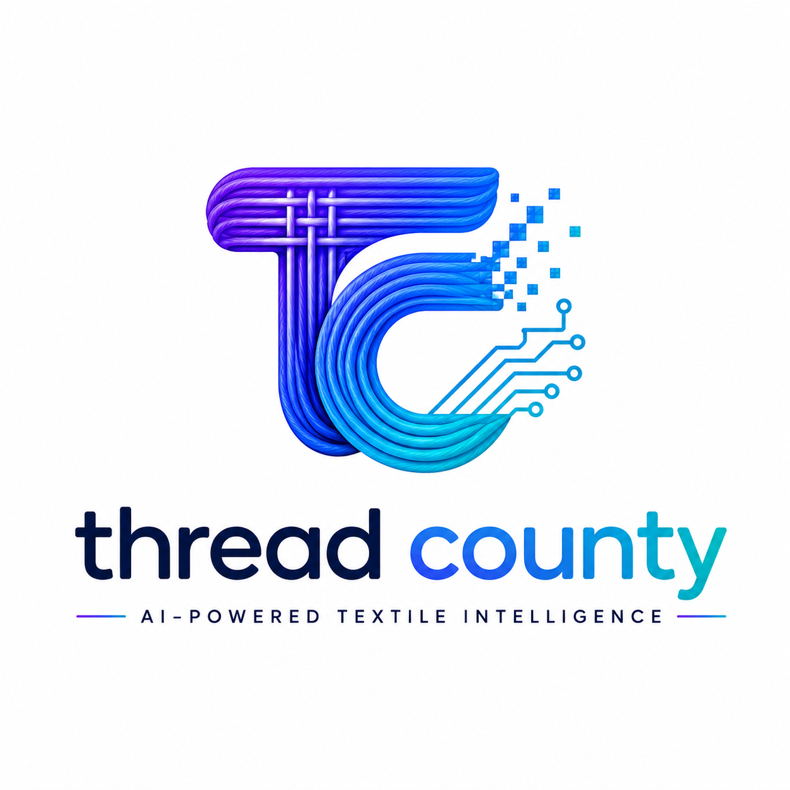

<div align="center">
  
</div>

# ThreadCounty

AI-powered textile analysis platform for identifying thread density, warp/weft counts, and fabric composition.

## Live Demo & Deployment
**Live Demo:** [https://threadcounty-frontend.onrender.com/en](https://threadcounty-frontend.onrender.com/en)

ThreadCounty is fully production-ready and designed for a 1-click deployment on **Render**. 
Simply connect this repository to Render and use the included `render.yaml` Blueprint to automatically provision and securely connect the Next.js Frontend and FastAPI Backend.

## About
ThreadCounty is an enterprise-grade application designed for textile manufacturers and researchers to automate the analysis of fabric images. It bridges modern web frameworks with computer vision heuristics. The current scope provides a complete frontend shell, strict authentication flow, an AI Chatbot, PWA capabilities, and a scalable FastAPI backend that handles computer vision heuristics via OpenCV.

## Features
- **PWA & Offline Support:** Installable as a native app on desktop and mobile devices via service workers.
- **Advanced Upload Capabilities:** Features client-side image compression (`browser-image-compression`) to save bandwidth and OCR Integration (`tesseract.js`) to extract fabric tags before AI analysis.
- **AI Chatbot & Voice Search:** Dedicated AI assistant with microphone dictation via the `SpeechRecognition` API, powered on the backend by **Groq** and `llama-3.3-70b-versatile` (along with `llama-3.2-11b-vision-preview` and `llama-3.1-8b-instant` for validation).
- **Mathematical Heuristic Firewall:** A robust OpenCV-based pipeline on the backend that calculates Color Histograms and Geometric Grids (via `HoughLinesP`) to mathematically intercept and reject documents and timetables before AI processing.
- **Base64 Storage Fallback Strategy:** If cloud storage buckets are unconfigured or restricted by RLS, the application dynamically falls back to Data URIs, storing raw image data directly into the database to guarantee 100% upload reliability.
- **Fabric Comparison Tool:** Dedicated dashboard utility to contrast and compare the density, warp, and weft of two historical analysis reports.
- **Real-Time Notifications:** Live toast popups triggered by Supabase Postgres changes to alert users of completed reports.
- **Custom Email Notifications:** Transactional emails powered by `resend` and `react-email` automatically dispatched upon analysis completion.
- **Multi-language Support:** Complete internationalization (i18n) via `next-intl` with a built-in language switcher and route-based locale handling.
- **Comprehensive Authentication:** Secure Sign Up, Login, Forgot Password flow, and Profile Management.
- **User Dashboard & History:** Infinite-scrolling history page to view past uploads, download PDF/txt reports, and manage quotas.
- **Admin Panel:** Platform overview, granular user role management (elevate users to admins), and global report monitoring.
- **Community & Content:** Includes a modern Blog and a functional Community Forum for users to interact.
- **Modern UI/UX:** Responsive design with system-wide Dark/Light mode, beautifully integrated Framer Motion global page transitions, and Shadcn UI.

## Tech Stack

| Layer | Technology |
|---|---|
| Frontend | Next.js 16 (Turbopack), React 19, Tailwind CSS v4, Framer Motion, Shadcn UI, next-pwa, next-intl, resend, react-email |
| Browser Processing | tesseract.js (OCR), browser-image-compression |
| Backend API | FastAPI (Python), OpenCV, NumPy, Groq (LLM Integration) |
| Database & Auth | Supabase (PostgreSQL, Supabase Auth SSR) |
| Deployment | Render (via `render.yaml` Infrastructure-as-Code) |

## Architecture
The platform operates on a robust two-tier architecture:
1. **Next.js Frontend:** Handles the UI, client-side routing, and PWA logic. Interacts directly with Supabase for Edge Middleware authentication and storage.
2. **FastAPI Backend:** Handles the intensive simulated computer vision processing (`/api/analyze`), chatbot routing, and admin operations. 

## Running Locally

1. **Clone the repository**
   ```bash
   git clone <repository-url>
   cd <repository-directory>
   ```

2. **Configure Database & Environment**
   - Create a Supabase project and run the SQL script located at `supabase/schema.sql` in your Supabase SQL editor.
   - Create a `.env.local` file in the `frontend` directory:
     ```env
     NEXT_PUBLIC_SUPABASE_URL=your_supabase_url
     NEXT_PUBLIC_SUPABASE_ANON_KEY=your_supabase_anon_key
     NEXT_PUBLIC_AI_BACKEND_URL=http://localhost:8000
     ```
   - Create a `.env` file in the `backend` directory:
     ```env
     SUPABASE_URL=your_supabase_url
     SUPABASE_KEY=your_supabase_service_role_key
     ```

3. **Start the Frontend**
   ```bash
   cd frontend
   npm install
   npm run dev
   ```
   The frontend will be available at `http://localhost:3000`.

4. **Start the Backend**
   Open a new terminal window:
   ```bash
   cd backend
   python -m venv venv
   # On Windows:
   .\venv\Scripts\activate
   # On macOS/Linux:
   # source venv/bin/activate
   pip install -r requirements.txt
   uvicorn main:app --reload
   ```
   The backend API will be available at `http://localhost:8000`.

## Project Structure
```text
.
├── backend/
│   ├── main.py                 # FastAPI application and OpenCV heuristics
│   └── requirements.txt        # Python dependencies
├── frontend/
│   ├── public/                 # Static assets and PWA manifest
│   ├── messages/               # i18n translation dictionaries (en.json, es.json)
│   ├── src/
│   │   ├── app/                # Next.js App Router (i18n localized routes, auth, dashboard)
│   │   ├── components/         # Reusable UI components (Shadcn, Chatbot, LanguageSwitcher)
│   │   ├── emails/             # React Email templates (ReportReady.tsx)
│   │   ├── i18n/               # next-intl configuration
│   │   ├── lib/                # Supabase client utilities
│   │   └── proxy.ts            # Edge middleware equivalent for session updates
│   ├── next.config.ts          # Turbopack, next-intl & PWA Configuration
│   └── package.json            # Node dependencies
├── supabase/
│   └── schema.sql              # Database schema definitions
└── render.yaml                 # Render Blueprint for 1-click deployment
```

## What I Learned
- **Decoupled Architecture:** Separating the AI processing into a FastAPI service rather than using Next.js API routes ensures that heavy Python-based ML/CV libraries won't bloat the frontend edge servers.
- **Client-Side Preprocessing:** Pushing tasks like Image Compression and basic OCR to the user's browser using Web Workers drastically reduces server bandwidth and backend processing times.
- **Algorithmic Fallbacks:** Implementing pure mathematical heuristics (like OpenCV geometric detection) is a necessary safety net against LLM hallucinations, ensuring strict data validation.
- **Progressive Enhancement:** Utilizing service workers and App Manifests to allow native installation brings web applications much closer to mobile application parity.
- **Route-based i18n:** Implementing `next-intl` demonstrated how powerful segment-based localized routing (`/en`, `/es`) is for SEO and global user experience.
- **Modern Email Templating:** Building HTML emails using standard React components via `react-email` and `resend` is vastly superior to writing raw, table-based HTML email code.
